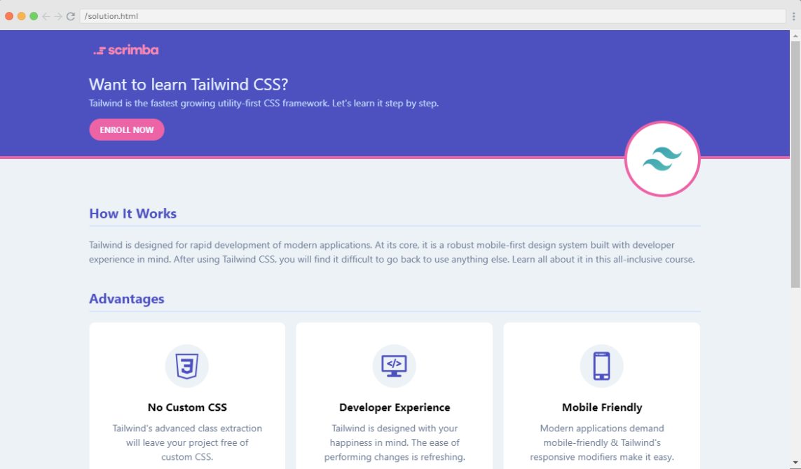
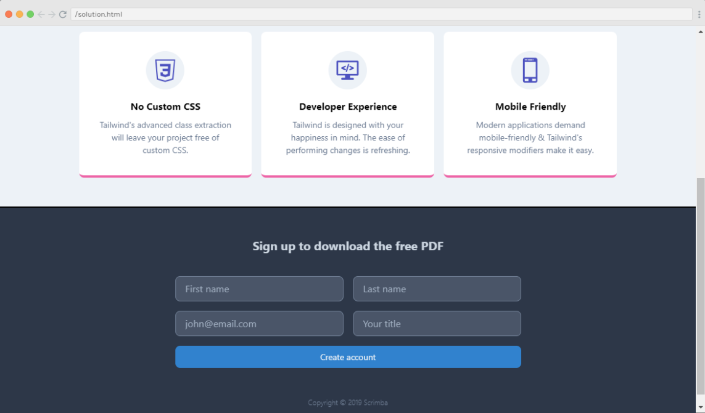
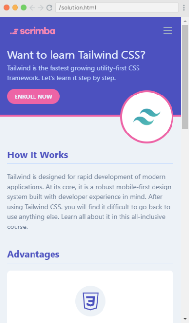
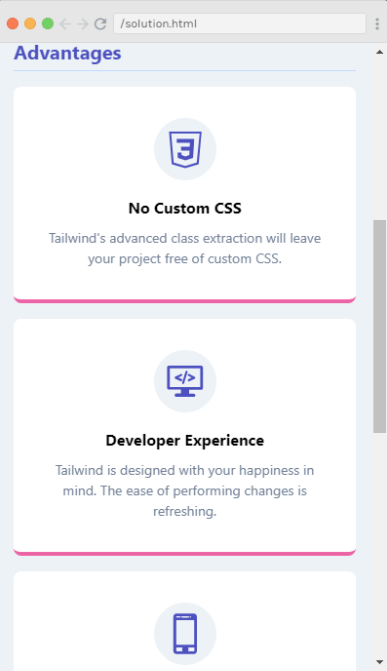
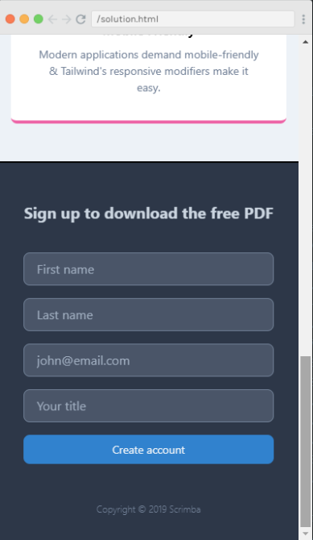

# Tailwind CSS Project: Landing Page

### It is a Project named "Landing Page" is created usign Tailwind CSS. It is a responsive website landing page that fits its styles and layout based upon the type of device.









Quick start:

```
$ npm install
$ npm start
````


Happy Coding!
