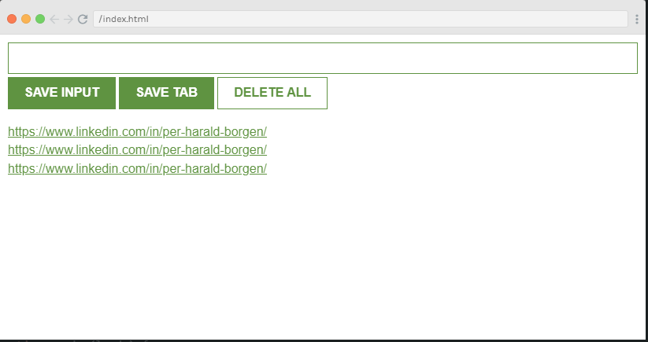

# Project: Leads Tracker Google Chrome Extension

## Description:
In this project, I created a Google Chrome Browser extension named ""Leads Tracker"" to track the websites.

## Features:
Using this extension, users can
- save any URL of websites that visit via explicitly adding a URL and then save
- can directly save the URL of any active window by clicking on ""save tab"" button
- delete all URLs
- URLs remain persistent even you refresh the window

## Output:

## Live Demonstration
https://github.com/zeeshanchana95/leads-tracker-chrome-extension/assets/74537328/05fa5e7a-0676-40cb-b864-143fc4ae7e13

Happy Coding!
